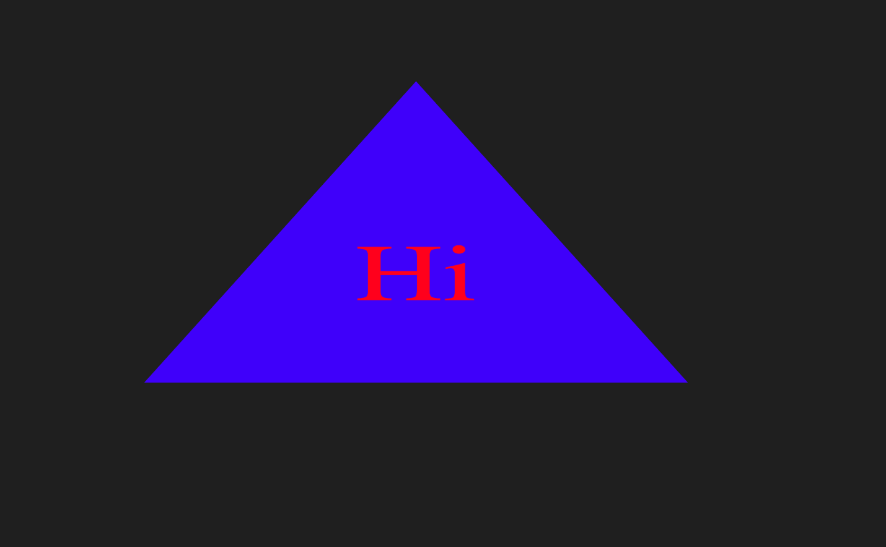
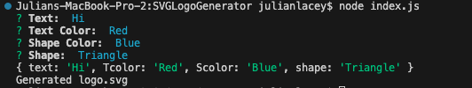

# Command Line SVG Generator

## Description

This application creates an SVG Image based on the user input in the terminal

## User Story

As a freelance web developer, I want to generate a simple logo for my projects, So I don't have to pay a graphic designer

## Acceptance Criteria

GIVEN a command-line application that accepts user input:

- WHEN I am prompted for text, then I can enter up to three characters

- WHEN I am prompted for the text color, then I can enter a color keyword (OR a hexadecimal number)

- WHEN I am prompted for a shape, then I am presented with a list of shapes to choose from: circle, triangle, and square

- WHEN I am prompted for the shape's color, then I can enter a color keyword (OR a hexadecimal number)

- WHEN I have entered input for all the prompts, then an SVG file is created named `logo.svg`, and the output text "Generated logo.svg" is printed in the command line

- WHEN I open the `logo.svg` file in a browser, then I am shown a 300x200 pixel image that matches the criteria I entered

## Mock-Up

The following animation demonstrates the application functionality:

https://github.com/JulianmLacey/SVGLogoGenerator/assets/117090683/04da29df-cd1d-4283-83dd-3abfb5f08781

https://github.com/JulianmLacey/SVGLogoGenerator/assets/117090683/476daeb3-8ab5-40aa-a4df-40142ce69851

## Live Demo

A Live Demo Can be Found [Here](https://julianmlacey.github.io/SVGLogoGenerator/)

## License

View "LICENSE" in Repository
